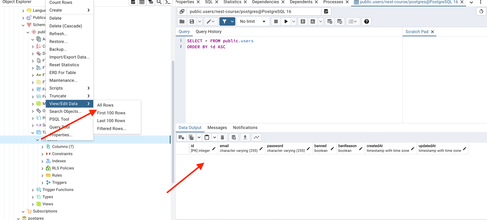

## STEP 1. Настройка проекта 
Создаем структуру без БД, смотрим как пишутся роуты через файлы 
app.service и app.controller

## STEP 2. PostgreSQL
Подключаем БД PostgrgeSQL

Описываем SequelizeModule.forRoot

Удаляем app.service и app.controller (я переместил в .temp)

Создаем папку users, с помощью nest cli мы можем сгенерировать модуль автоматически прописав команду в консоли:

```bash
nest generate module users   
```

Так же создадим контроллер и сервис:
```bash
nest generate controller users   
nest generate service users   
```

## STEP 3
- Устанавливаем  @nestjs/config и в app.module.ts подключаем ConfigModule
- Устанавливаем cross-env для разных конфигураций (dev or prod)
- Конфигурируем .env файлы

## STEP 4
Описываем users.model.ts

Используем sequelize-typescript

Подключаем модель в app.module.ts и user.module.ts

В pg admin мы можем увидеть появившиеся поля:



## STEP 5. Swagger
Устанавливаем  @nestjs/swagger swagger-ui-express

```bash
npm i @nestjs/swagger swagger-ui-express       
```

Создаем config проекта в main.ts (экземпляр для создания Документации swagger)

Создаем и инициализируем экземпляр документа (SwaggerModule)

Используем декораторы swagger чтобы задокументировать наши методы

- В users.model.ts используем ApiProperty
- В users.controller.ts используем ApiTags, ApiOperation,
- В create-user.dto.ts так же используем ApiProperty

## STEP 6. Роли пользователя
Создаем сервис, контроллер и модуль для ролей

```bash
nest generate module roles
nest generate service roles
nest generate controller roles
```

Таблица роли будет иметь 2 поля value и description.
Заполняем модуль по аналогии c users

### Связь многие ко многим
В случае такой связи создается промежуточная таблица, наша таблица будет указывать
какой пользователь какими ролями обладает, в ней есть 
2 внешних ключа: на таблицу пользователей, на таблицу ролей

В roles.model.ts создаем декоратор BelongsToMany, в нем указываем с какой сущностью мы связываем модель и через какую таблицу
```ts
@BelongsToMany(() => User, () => UserRoles)
```

Аналогичные действия мы делаем в users.model.ts
```ts
@BelongsToMany(() => Role, () => UserRoles)
```

В user.module и role.module нужно добавить используемые модели

Создаем файл user-roles.model.ts, в параметрах таблицы 
createdAt, updatedAt ставим false чтобы не захламлять таблицу датами создания

Прописываем UserRoles в импортах файлов model.ts

### Функции получения и добавления ролей.

Создаем функции createRole и getRoleByValue в папке roles.servie

Связываем RolesModule с модулем users.
Внутри user.module прописываем RolesModule внутри imports 
Внутри role.module добавляем опцию:  exports: [RolesService]

## STEP 7. Авторизация пользователя

Создаем модуль авторизации:

```bash
nest generate module auth 
nest generate service auth 
nest generate controller auth 
```

Устанавливаем библиотеку для работы с jwt токеном и модуль для шифрования паролей bcryptjs

Прим: в офф. документации для авторизации по jwt токену рекуомендуют использовать passport-js
Но мы для понимания пишем функционал сами 
```bash
npm i @nestjs/jwt bcryptjs
```

Описываем модули auth, импортируем в него UsersModule и JwtModule
Добавляем PRIVATE_KEY в .development.env

В JwtModule следующие опции:
secret - секретный ключ который достаем из системных переменных
signOptions: {expiresIn: '24h'} - время жизни токена

Cоздаем функцию getUsersByEmail поиска пользователя внутри user.service
Писпользуем ее внутри auth.service для проверки пользователя на существование.
Затем хэшируем пароль.

Функция регистрации в результате вернет токен с помощю функции generageToken которую мы опишем ниже

Проверяем создание токена в postman

На сайте jwt.io можно посмотреть поля токена. На текущем этапе там не будет ролей.

Для того чтобы это решить мы в user.servise добавим поле role в объект user.roles

Добавляем валидацию для авторизации ползователя

## STEP 8. Guards

Метод canActivate является частью гварда аутентификации (authentication guard).

После описания метода добавим экспорты AuthService и JwtModule в auth.module 

А так же в user.module добавляем AuthModule

Получили ошибку:  A circular dependency between modules. (кольцевая зависимость, модуль User используется внутри модуля Auth и наоборот)

Для того чтобы избежать этого используем функцию forwardRef

Добавляем  @UseGuards(JwtAuthGuard) внутри users.controller

Теперь если мы отправим запрос на полyчение пользователей мы получим "пользователь не авторизован"

Создадим roles-auth.decorator (он просто прокидывает список ролей)

Далее в roles.guard добавляем в класс reflector и переменную requiedRoutes

В user.controller добавляем декораторы @Roles("ADMIN") и @UseGuards(RoleGuard) чтобы список пользователей был доступен только админам

## STEP 9. Выдача ролей и бан пользователя 

В users.controller добавили 2 эндпоинта для выдачи роллей и бана пользователей, а в 
users.service реализуем эти функции.

## STEP 10. Валидация входных и выходных данных.

